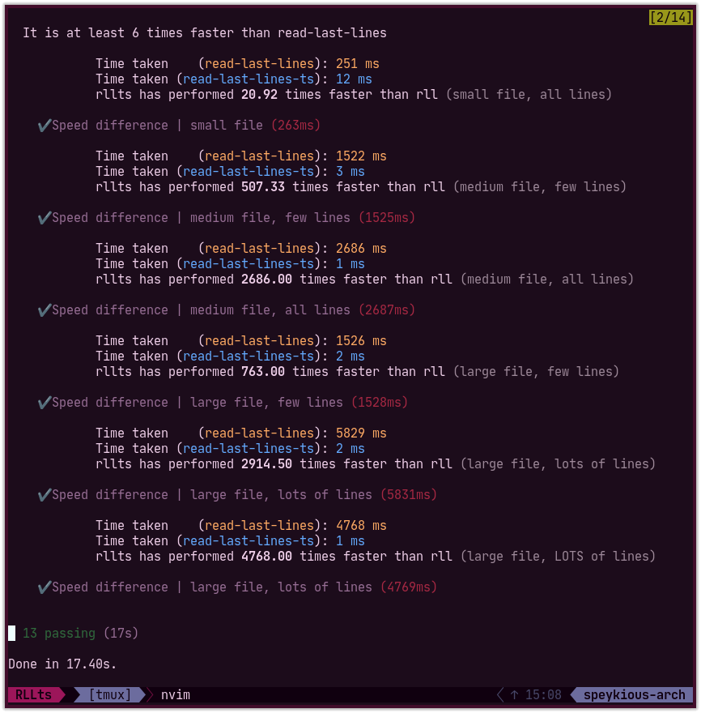

# Read Last Lines (TypeScript)

Read the last lines of a file, written in TypeScript for intellisense, rewritten
from the current [read-last-lines](https://github.com/alexbbt/read-last-lines)
package by [Alexander Bell-Towne](https://github.com/alexbbt).

Copyright © 2020 [Speykious](https://github.com/Speykious)

***
Summary
- [Read Last Lines (TypeScript)](#read-last-lines-typescript)
	- [How to install](#how-to-install)
	- [How to use](#how-to-use)
		- [CommonJS syntax](#commonjs-syntax)
		- [ESX syntax](#esx-syntax)
	- [Miscellaneous](#miscellaneous)
***

## How to install

- If you use `npm`: `npm install read-last-lines-ts --save`
- If you use `yarn`: `yarn add read-last-lines-ts`


## How to use

`read-last-lines-ts` supports absolute and relative paths since version **1.1.0**.

**New in v1.2.0**: *literally **1000** times faster!!!*

### CommonJS syntax
To read the last 10 lines of a file in utf8 encoding:
```js
const { readLastLines, readLastLinesEnc } = require("read-last-lines-ts")

// You get a Buffer from readLastLines
const buffer = readLastLines("path/to/file", 10)
console.log(buffer.toString("utf8"))

// You can specify a buffer length (default is 4096) ─ example: 50 chars at a time!
// The bufferLength parameter is the length of the internal buffer used for reading
const buffer = readLastLines("path/to/file", 10, 50)

// Alternatively, you can use this curried function for builtin string conversion
// (PS: the optional bufferLength parameter also works here)
const lines = readLastLinesEnc("utf8")("path/to/file", 10)
console.log(lines)
```
You can choose any encoding from the `BufferEncoding` enum from `fs`.
Also, the `readLastLinesEnc` function has been curried so that it is
easier to deal with encoding: just make some variable
`const rll_utf8 = readLastLinesEnc("utf8")` and you got yourself a
nice short function for reading last lines with utf8 encoding.

### ESX syntax
Same example:
```js
import { readLastLines, readLastLinesEnc } from "read-last-lines-ts"

const buffer = readLastLines("path/to/file", 10)
console.log(buffer.toString("utf8"))

// Optional bufferLength argument
const buffer = readLastLines("path/to/file", 10, 50)

// Or:
const lines = readLastLinesEnc("utf8")("path/to/file", 10)
console.log(lines)
```
You can code in JavaScript, TypeScript, CoffeeScript, whatever is in your best interest.

## Miscellaneous
The `read-last-lines-ts` package is very often
**1000s of times faster** than the `read-last-lines` package,
as these speed tests indicate:

[](resources/screenshot-test.png)

When I looked at the code for the `read` function of the `read-last-lines` package,
there were a lot of things for which I quite didn't understand the motivation behind.

There was absolutely no use of any kind of for loop or while loop, nor any use of async/await.
Maybe it was for some kind of backwards-compatibility?

Also, why did they use a custom file system library `mz/fs` instead of the native `fs`?
Was there no `fs` back then?

They also used a *ton* of async behavior on all kinds of
places where it wasn't necessary. Maybe that was a factor for how slow it is compared
to this modern sync version.

If someone wants to explain any of these things to me, or point out a bug / problem,
or request a feature, don't hesitate to raise an issue on the [github repo](https://github.com/Speykious/read-last-lines-ts). 😁